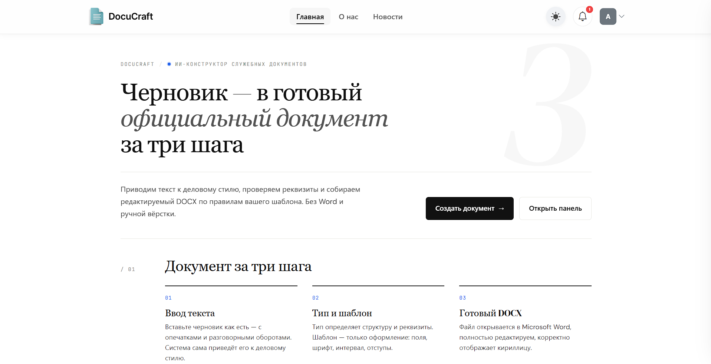
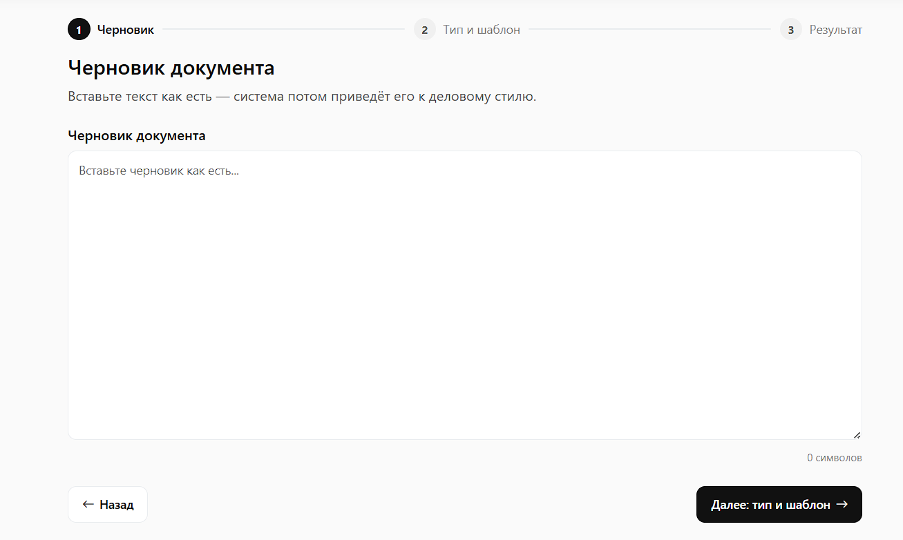
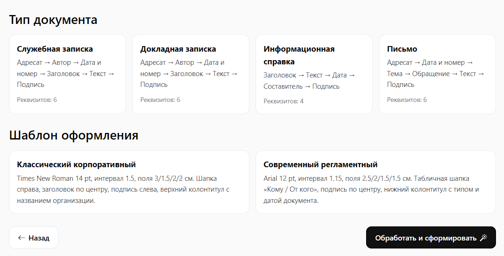
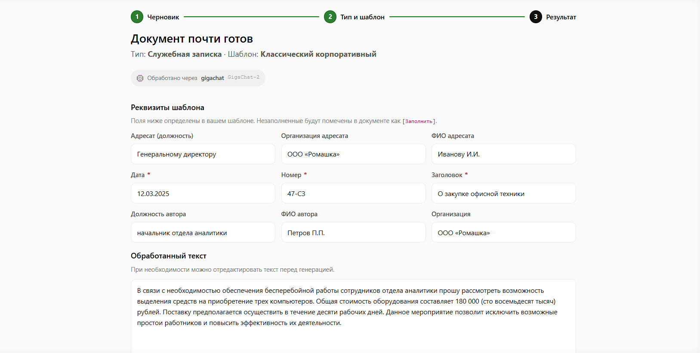
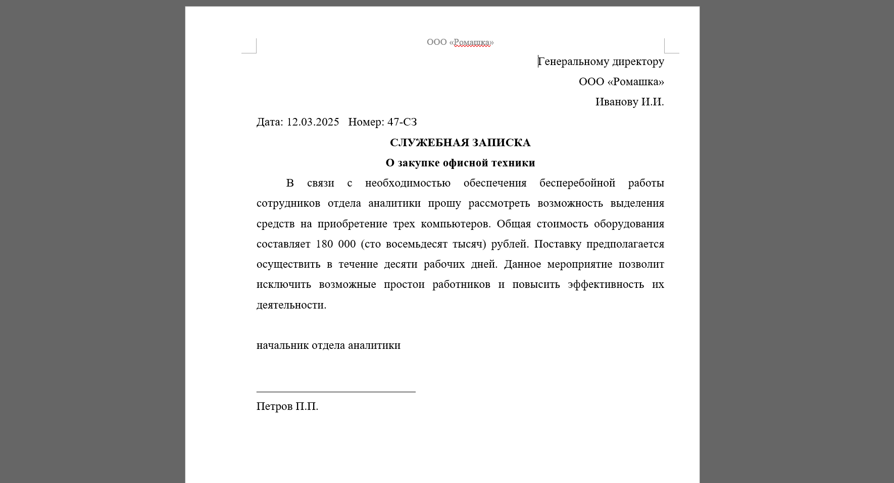
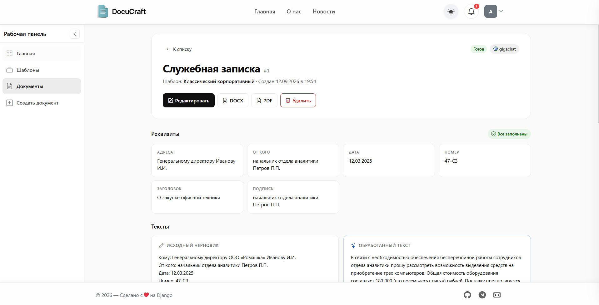
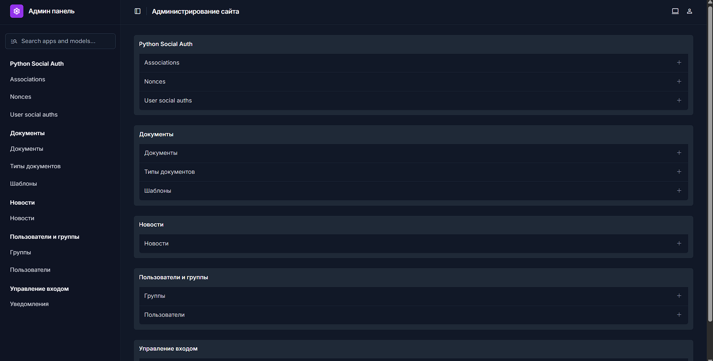
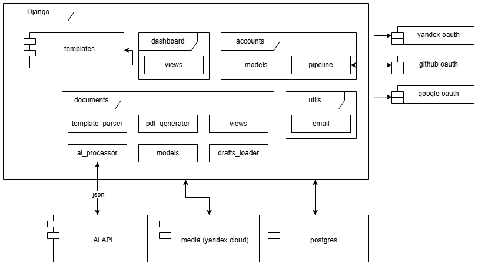
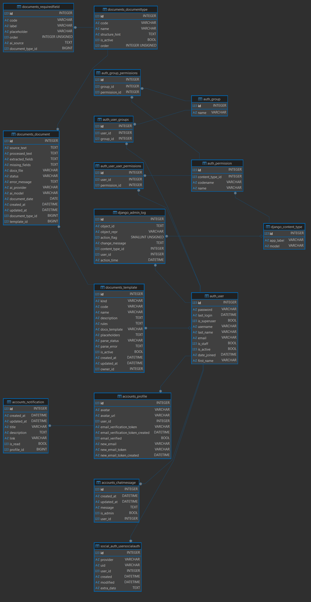
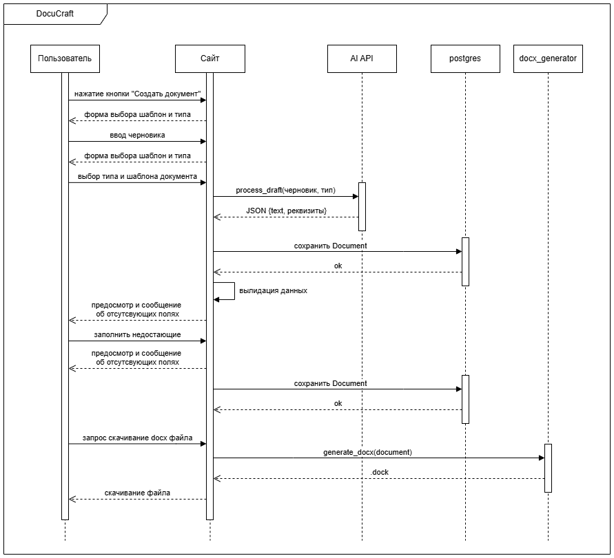

# DocuCraft — ИИ-конструктор служебных документов

[](https://github.com/mario12508/DocuCraft/actions/workflows/tests.yml)

**Сайт:** https://docucraft-kmwn.onrender.com (возможно необходим впн для работы)

**Репозиторий:** https://gitverse.ru/hackrus.experts/cempionat-fsp-2026_it_miks_39

Сервис превращает черновик пользователя в готовый редактируемый DOCX-документ. ИИ приводит текст к официально-деловому стилю, не искажая смысла и не добавляя отсутствующих фактов. Программный модуль применяет правила выбранного шаблона и формирует файл.

---

## Оглавление

- [О проекте](#о-проекте)
- [Как это работает](#как-это-работает)
- [Возможности](#возможности)
- [Типы документов](#типы-документов)
- [Шаблоны оформления](#шаблоны-оформления)
- [ИИ-провайдеры](#ии-провайдеры)
- [Технологии](#технологии)
- [Диаграммы](#диаграммы)
  - [Компонентная диаграмма](#компонентная-диаграмма)
  - [Модель данных](#er-диаграмма)
  - [Диаграмма последовательности](#диаграмма-последовательности)
- [Добавление нового типа документа](#добавление-нового-типа-документа)
- [Логика работы с ИИ](#логика-работы-с-ии)
  - [Системный промпт](#системный-промпт)
  - [Пример обработки](#что-происходит-дальше)
  - [Защита от галлюцинаций](#защита-от-галлюцинаций)
- [Тестовый доступ/Данные для входа](#тестовый-доступ)
- [Инструкция по запуску](setup.md)

---

## Скриншоты

<table>
  <tr align="center">
    <td colspan="2">
      <br>
      <em>Главная страница</em>
    </td>
  </tr>
  <tr>
    <td align="center">
      <br>
      <em>Шаг 1. Ввод черновика</em>
    </td>
    <td align="center">
      <br>
      <em>Шаг 2. Тип документа и шаблон</em>
    </td>
  </tr>
  <tr>
    <td align="center">
      <br>
      <em>Шаг 3. Предпросмотр и правки</em>
    </td>
    <td align="center">
      <br>
      <em>Готовый документ в Word</em>
    </td>
  </tr>
  <tr>
    <td align="center">
      <br>
      <em>Детализация документа</em>
    </td>
    <td align="center">
      <br>
      <em>Админ панель</em>
    </td>
  </tr>
</table>

---

## О проекте

Подготовка служебных документов — служебных и докладных записок, информационных справок, писем — часто превращается в рутинный процесс с многократными исправлениями. Сотрудник вручную переносит текст в шаблон, настраивает шрифты, поля и отступы, отдельно проверяет орфографию и стилистику, вспоминает требования к реквизитам. При копировании между документами возникают ошибки форматирования.

DocuCraft объединяет работу с содержанием и оформлением в одном сценарии:

- **ИИ улучшает текст** — исправляет ошибки, приводит формулировки к деловому стилю, структурирует по смыслу.
- **Программный шаблон** гарантирует единообразие и соответствие стандартам оформления.
- **Система валидации** проверяет обязательные реквизиты по типу документа и явно помечает незаполненные поля.

Ключевой принцип: **ИИ не имеет права добавлять факты, даты, фамилии и номера, которых не было в исходном черновике.** Работа с содержанием полностью отделена от применения правил оформления.

---

## Как это работает

Пользователь проходит три шага:

1. **Ввод текста.** Вставляет черновик как есть — с опечатками, разговорными оборотами и отсутствием структуры.
2. **Тип и шаблон.** Выбирает тип документа и оформление организации. Тип определяет структуру и набор обязательных реквизитов, шаблон — только визуальное оформление.
3. **Результат.** Система обрабатывает текст через ИИ, проверяет реквизиты, показывает предпросмотр и формирует готовый DOCX-файл.

---

## Возможности

- **ИИ-обработка текста** — исправление орфографии, грамматики, пунктуации, приведение к официально-деловому стилю.
- **Структурирование по смыслу** — разбивка на логические абзацы, добавление деловых вводных оборотов без выдумывания фактов.
- **Защита от галлюцинаций** — модель не добавляет имена, организации, даты, суммы и реквизиты, которых не было в черновике.
- **Извлечение реквизитов** — AI возвращает структурированный JSON с адресатом, автором, датой, номером и темой документа.
- **Валидация обязательных полей** — проверка по типу документа, явная подсветка недостающих реквизитов.
- **Работа с плейсхолдерами** — незаполненные поля помечаются в документе как `[Заполнить]`.
- **4 типа документов** — служебная записка, докладная записка, информационная справка, письмо.
- **2 шаблона оформления** — классический корпоративный и современный регламентный, отличаются шрифтом, полями, интервалами и структурой колонтитулов.
- **Программная генерация DOCX** — редактируемый файл, корректно отображающий кириллицу, открывается в Microsoft Word.
- **PDF-экспорт** — дополнительная возможность для быстрой отправки документа.
- **Предпросмотр и ручные правки** — можно отредактировать текст и реквизиты перед скачиванием.
- **Fallback-цепочка ИИ-провайдеров** — при недоступности одного сервиса запрос автоматически переключается на следующий.
- **История документов** — список созданных документов с фильтрами по типу и статусу.
- **Тёмная и светлая темы** с сохранением выбора.
- **OAuth2-аутентификация** — вход через Яндекс, GitHub, Google.
- **Административная панель** на базе Django Unfold.

---

## Типы документов

| Тип | Назначение | Обязательные реквизиты |
|-----|------------|-----------------------|
| **Служебная записка** | Внутренняя переписка по рабочим вопросам | Адресат, автор, дата, номер, заголовок, текст, подпись |
| **Докладная записка** | Уведомление руководства о событии или нарушении | Адресат, автор, дата, номер, заголовок, текст, подпись |
| **Информационная справка** | Констатация фактов и итогов без адресата | Заголовок, дата, составитель, текст, подпись |
| **Письмо** | Внешняя переписка с контрагентами | Адресат, отправитель, дата, номер, тема, текст, подпись |

---

## Шаблоны оформления

**Классический корпоративный**
- Times New Roman 14 pt, интервал 1.5
- Поля: 3 / 1.5 / 2 / 2 см
- Шапка справа, заголовок по центру, подпись слева
- Верхний колонтитул с названием организации

**Современный регламентный**
- Arial 12 pt, интервал 1.15
- Поля: 2.5 / 2 / 1.5 / 1.5 см
- Табличная шапка «Кому / От кого», подпись по центру
- Нижний колонтитул с типом и датой документа

---

## ИИ-провайдеры

Сервис использует цепочку провайдеров — если один недоступен, запрос автоматически уходит к следующему:

| Провайдер | Модель | Примечание |
|-----------|--------|------------|
| GigaChat (Сбер) | `GigaChat-2` | Работает из РФ без VPN, бесплатный лимит |
| Groq | `openai/gpt-oss-120b` | Основной быстрый |
| Groq | `openai/gpt-oss-20b` | Резервный быстрый |
| Google Gemini | `gemini-3.8-flash` | Независимый резерв |
| OpenRouter | `nvidia/nemotron-3.5-lightning:free` | Бесплатные модели |

Если все провайдеры недоступны, черновик **сохраняется**, документ помечается статусом «Ошибка», а пользователю предлагается повторить обработку.

---

## Тестовый доступ

| **Логин** | **Пароль** | **Роль** |
|-----------|------------|----------|
| `admin`   | `admin123` | Админ    |

При первом запуске через Docker суперпользователь создаётся автоматически из переменных окружения.

---

## Технологии

- **Backend:** Django 5.1, Python 3.12
- **База данных:** PostgreSQL 15, поддержка SQLite и внешних URL через `dj-database-url`
- **ИИ:** OpenAI-совместимые API — GigaChat, Groq, Google Gemini, OpenRouter
- **Генерация документов:** `python-docx` (DOCX), `reportlab` (PDF), `mammoth` (предпросмотр)
- **Frontend:** Bootstrap 5, CSS-переменные, vanilla JavaScript
- **Аутентификация:** `social-auth-app-django` (Яндекс, GitHub, Google)
- **Хранение медиа:** локальное или Yandex Cloud Object Storage (S3)
- **Админка:** Django Unfold
- **Деплой:** Docker, Docker Compose, Render

---

## Диаграммы

### Компонентная диаграмма

Архитектура проекта: Django-приложения, внешние зависимости и потоки данных.


[Диаграмма компанентов](docs/component.drawio.pdf)

**Ключевые компоненты:**

- **`dashboard`** — UI-слой рабочей панели (списки документов и шаблонов, карточки, удаление).
- **`documents`** — основная логика: модели, вьюхи, ИИ-обработка, валидация реквизитов, генерация DOCX/PDF.
- **`accounts`** — аутентификация и профиль пользователя.
- **`utils`** — общие утилиты (уведомления, почта).
- **`templates`** — общие HTML-шаблоны.

**Внешние системы:**

- **AI API** (GigaChat, Groq, Gemini, OpenRouter) — обработка текста, извлечение реквизитов.
- **media (Yandex Cloud S3)** — хранение `.docx`-шаблонов и сгенерированных файлов.
- **PostgreSQL** — документы, типы, шаблоны, реквизиты.
- **OAuth2-провайдеры** (Яндекс, GitHub, Google) — вход в систему.

---

### ER-диаграмма


[ER-диаграмма](images/er.drawio.png)

### Диаграмма последовательности

Полный путь пользователя: от ввода черновика до скачивания готового файла.


[Диаграмма последовательности](docs/sequence.drawio.pdf)

**Что важно:**

1. **Три шага ТЗ** — черновик → тип/шаблон → результат.
2. **ИИ и генератор разделены**: `AI API` возвращает **только JSON** с текстом и реквизитами, `docx_generator` формирует файл по шаблону.
3. **Валидация реквизитов** — программная, без ИИ.
4. **Все данные сохраняются в БД** на каждом шаге — статусы `processing → ready / draft`.
5. **Fallback-цепочка ИИ-провайдеров** — при недоступности одного сервиса запрос уходит к следующему.

---

## Добавление нового типа документа

Через административную панель → «Типы документов»:

1. Укажите `code`, `name`, `structure_hint`.
2. Добавьте обязательные реквизиты. Для каждого поля задаются:
   - `code` — внутренний идентификатор;
   - `label` — отображаемое название;
   - `ai_source` — список ключей из ответа ИИ, например `["addressee_position", "addressee_name"]`.

Тип появляется на Шаге 2 автоматически.

---

---

## Логика работы с ИИ

### Системный промпт

Модель вызывается с жёстким system-промптом, который запрещает выдумывать факты. Ключевые правила:

1. Исправить орфографию, грамматику, пунктуацию.
2. Привести формулировки к официально-деловому стилю, сохранив смысл.
3. **Не выдумывать** отсутствующие факты: имена, организации, даты, номера, суммы.
4. Расширять и структурировать текст, но без добавления новых фактов.
5. Суммы дублировать словами: `180 000 (сто восемьдесят тысяч) рублей`.

Модель обязана вернуть **строго JSON** со следующими полями:

```json
{
  "addressee_position": "должность адресата или null",
  "addressee_org":      "название организации адресата или null",
  "addressee_name":     "ФИО адресата или null",
  "author_position":    "должность автора или null",
  "author_org":         "название организации автора или null",
  "author_name":        "ФИО автора или null",
  "date":               "ДД.ММ.ГГГГ или null",
  "number":             "регистрационный номер или null",
  "topic":              "тема документа или null",
  "body":               "исправленный основной текст"
}
```

### Пример: черновик

```
Кому: генеральному директору ООО Ромашка Иванову И.И.
От кого: начальник отдела аналитики Петров П.П.
Дата 12.03.2025
Номер 47-СЗ
Заголовок О закупке офисной техники

Здрасьте! Нам надо купить три компа для отдела аналитики,
потому что старые уже не работают. Вообщем, цена 180000 рублей.
Поставщик ТехноСнаб обещал привезти за 10 дней.
```

### Пример: ответ модели

```json
{
  "addressee_position": "Генеральному директору",
  "addressee_org": "ООО «Ромашка»",
  "addressee_name": "Иванову И.И.",
  "author_position": "Начальник отдела аналитики",
  "author_org": null,
  "author_name": "Петров П.П.",
  "date": "12.03.2025",
  "number": "47-СЗ",
  "topic": "О необходимости закупки офисной техники",
  "body": "В связи с необходимостью обеспечения бесперебойной работы отдела аналитики прошу рассмотреть возможность выделения бюджетных средств на приобретение трёх комплектов компьютерного оборудования.\n\nОбщая стоимость закупки составляет 180 000 (сто восемьдесят тысяч) рублей. Поставщик — ООО «ТехноСнаб» — готов осуществить поставку в течение десяти рабочих дней с момента оплаты.\n\nПриобретение техники позволит обеспечить выполнение текущих задач отдела в установленные сроки."
}
```

### Что происходит дальше

1. **Модуль валидации** сверяет поля с обязательными реквизитами выбранного типа документа. Если чего-то нет — код попадает в `missing_fields`.
2. **Дата и номер** заполняются автоматически: дата — текущая, если модель вернула `null`; номер — сгенерированный по шаблону `01-СЗ / 02-ДЗ / 01-П`, если его не было в тексте.
3. **Программный генератор DOCX** применяет `Template.rules` и формирует файл. Никакие настройки оформления от модели не используются.

### Защита от галлюцинаций

- Промпт явно запрещает выдумывать факты.
- Модели даются **заглушки в квадратных скобках** вместо примеров вида «Иванов И.И.» — чтобы она не копировала примеры.
- Модуль `_clean_value` дополнительно отсекает ответы `"null"`, `"None"`, `"нет данных"` — как строки, так и JSON-литералы.
- Fallback-механизм: если GigaChat недоступен, запрос уходит к Groq → Gemini → OpenRouter. Если и они упали — черновик сохраняется, документ помечается статусом «Ошибка», пользователь может повторить.

### Пример теста

Юнит-тесты парсера JSON от ИИ запускаются одной командой:

```bash
cd web
pip install -r requirements-dev.txt
pytest apps/documents/tests/test_ai_processor.py -v
```

---

> **Примечание:** Инструкцию по локальному запуску и развёртыванию смотрите в файле [setup.md](setup.md).